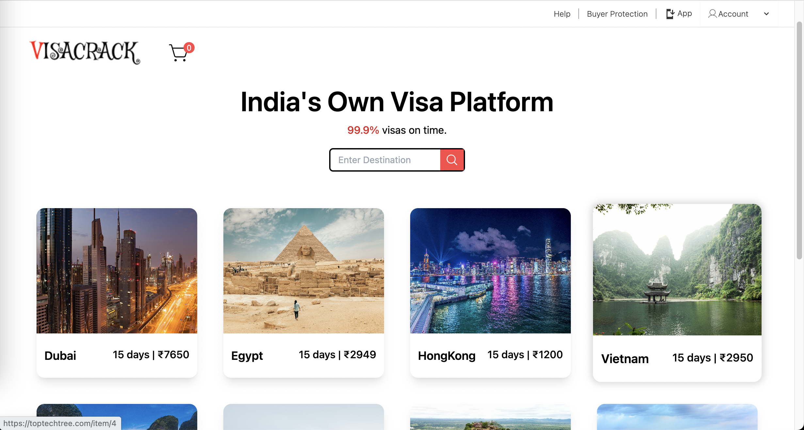
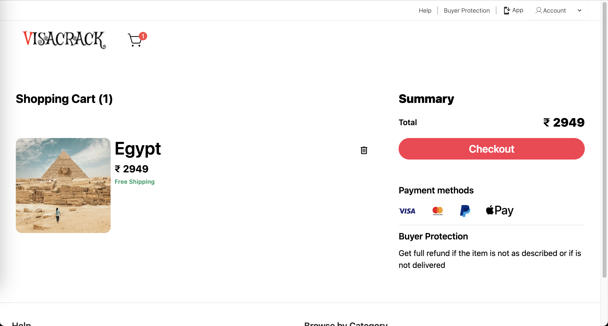

# VISACRACK

This micro e-commerce website, built on the Nuxt framework for Vue.js, is designed to meet specific requirements, including:

- Offering a limited range of products (e.g., visas for different countries).
- Providing a search feature for users to find these products.
- Implementing a shopping cart system for users to add and manage their selected items.
- Integrating payment processing through Stripe for seamless transactions.
- Enabling user authentication via Google OAuth for secure access.
- Collecting user details, including phone numbers, addresses, and travel dates using a calendar input.
- Facilitating document uploads, likely related to travel documentation.

Here's an overview of the technology stack used for this project:

**Frontend:**

- HTML and CSS are styled using the Tailwind CSS framework.
- JavaScript powers the dynamic functionality, with Vue.js and the Nuxt.js framework for creating robust, server-rendered web applications.
- Prisma serves as the Object-Relational Mapping (ORM) tool for database interactions.
- Nuxt provides server-side rendering capabilities for enhanced performance and SEO.

**Backend:**

- The Nuxt server-side is responsible for handling server-side logic.
- Supabase serves as the database, likely storing product information, user details, and order history.

**Authentication:**

- Google OAuth is implemented for secure user authentication.
- Supabase, in combination with Google Cloud Platform (GCP), handles authentication processes.

This technology stack is well-suited for building a modern, feature-rich e-commerce website with robust frontend and backend capabilities, secure authentication, and seamless payment processing.

These are the setup steps for your application, to be run on your local machine:

**App Setup (localhost):**

```bash
# Copy the environment configuration
cp .env.example .env

# Install dependencies
npm install

# Generate Prisma code
npx prisma generate

# Start the development server
npm run dev
```

**First-Time Setup for a Blank Project:**

```bash
# Create a new Vite project with Vue template
npm create vite@latest visacrack --template vue

# Install necessary dependencies
npm install @nuxtjs/supabase @nuxtjs/tailwindcss nuxt-icon @pinia-plugin-persistedstate/nuxt @pinia/nuxt @prisma/client @stripe/stripe-js nuxt-lodash prisma stripe

# Start the development server
npm run dev
```

**Prisma Setup (to be done at Supabase):**

```bash
# Initialize Prisma
npx prisma init

# Generate Prisma code
npx prisma generate

# Run the initial database migration (use a name like "init")
npx prisma migrate dev --name init

# Seed the database with initial data
npx prisma db seed
```

These commands set up your application, install dependencies, configure environment variables, generate Prisma code, and initialize your database. Make sure to follow these steps in the specified order to have your application up and running on your localhost.

## Live Demo

You can access the live production version of this app at [https://toptechtree.com](https://toptechtree.com) hosted in netlify.

This is a screenshot of visacrack app home page:



And here's another screenshot of cart page:



## License

This project is available under the [CC BY-NC-ND 4.0](https://creativecommons.org/licenses/by-nc-nd/4.0/).

Enjoy seamless interactions between Slack and the OpenAI API with Slack-OpenAI Middleware!
